# Custom Logic Scripting Language - Complete Reference
> [!CAUTION]
> This document was generated using copilot after providing a very large amount of reference material and manually linking important sections of the language together as file/snippet references.
> It is useful as a preamble to get copilot to generate working custom logic scripts but may contain inaccuracies or outright incorrect information.
> Please refer to the official documentation and source code for the most accurate and up-to-date information.

## Table of Contents
1. [Overview](#overview)
2. [Language Syntax](#language-syntax)
3. [Architecture & Implementation](#architecture--implementation)
4. [Class Types](#class-types)
5. [Builtin System](#builtin-system)
6. [Namespace Isolation](#namespace-isolation)
7. [Compilation Pipeline](#compilation-pipeline)
8. [Code Examples](#code-examples)
9. [Testing Framework](#testing-framework)

---

## Overview

Custom Logic is a Python/CSharp-like scripting language designed for the Attack on Titan Tribute Game 2 (AoTTG2). It allows users to create custom game modes, map scripts, and game logic without modifying the core C# codebase.

### Key Features
- **Python/CSharp-like syntax** - Familiar to web developers
- **Multi-file compilation** - BaseLogic, Addons, MapLogic, ModeLogic
- **Namespace isolation** - Prevents conflicts between files
- **C# interop** - Access Unity/game features through builtins
- **Offline testing** - Test scripts without running the game
- **Component system** - Attach scripts to map objects

### File Types (Namespaces)

| Namespace | Purpose | Isolation Level | Examples |
|-----------|---------|-----------------|----------|
| **BaseLogic** | Core extensions/utilities | High - protected from overrides | Utility functions, common helpers |
| **Addon** | Reusable extensions | Medium - can be overridden | Community libraries |
| **MapLogic** | Map-specific logic | Medium - map-bound | Map components, triggers |
| **ModeLogic** | Game mode scripts | Low - highest priority | Custom game modes |

---

## Language Syntax

### Basic Structure

```javascript
// Comments start with # or //
# This is a comment
// This is also a comment

// Variable declaration (no var/let/const keywords)
myVariable = 10;
myString = "Hello";
myBool = true;
myNull = null;

// Arithmetic operators
result = 5 + 3;      // Addition
result = 10 - 4;     // Subtraction
result = 6 * 7;      // Multiplication
result = 20 / 4;     // Division
result = 10 % 3;     // Modulo

// Comparison operators
if (x == y) { }      // Equals
if (x != y) { }      // Not equals
if (x < y) { }       // Less than
if (x > y) { }       // Greater than
if (x <= y) { }      // Less than or equals
if (x >= y) { }      // Greater than or equals

// Logical operators
if (a && b) { }      // AND
if (a || b) { }      // OR
if (!a) { }          // NOT

// Compound assignment
x += 5;              // x = x + 5
x -= 3;              // x = x - 3
x *= 2;              // x = x * 2
x /= 4;              // x = x / 4
```

### Control Flow

```javascript
// If-else statements
if (condition)
{
    // code
}
elif (otherCondition)
{
    // code
}
else
{
    // code
}

// While loops
i = 0;
while (i < 10)
{
    i = i + 1;
}

// For-in loops (iterate over collections)
myList = List(1, 2, 3, 4, 5);
for (item in myList)
{
    Game.Print(item);
}

for (i in Range(10))
{
    Game.Print(i);  // Prints 0 to 9
}

// Break and continue
while (true)
{
    if (condition)
    {
        break;      // Exit loop
    }
    if (skip)
    {
        continue;   // Skip to next iteration
    }
}
```

### Functions

```javascript
// Function declaration
function MyFunction(param1, param2)
{
    result = param1 + param2;
    return result;
}

// Function call
value = MyFunction(5, 10);

// Coroutines (can use wait statements)
coroutine MyCoroutine()
{
    Game.Print("Starting...");
    wait 1.0;  // Wait 1 second
    Game.Print("Done!");
}

// No return value
function DoSomething()
{
    // If no return, returns null
}
```

### Classes

```javascript
class MyClass
{
    // Field declarations with default values
    _myField = 0;
    _myString = "default";
    
    // Constructor (called Init)
    function Init(initialValue)
    {
        self._myField = initialValue;
    }
    
    // Instance methods
    function GetValue()
    {
        return self._myField;
    }
    
    function SetValue(newValue)
    {
        self._myField = newValue;
    }
}

// Instantiation
instance = MyClass(42);
value = instance.GetValue();
instance.SetValue(100);
```

---

## Architecture & Implementation

### Core Components

```
┌─────────────────────────────────────────────────────────────┐
│                     Custom Logic System                      │
├─────────────────────────────────────────────────────────────┤
│                                                               │
│  ┌──────────────┐    ┌──────────────┐    ┌──────────────┐  │
│  │   Compiler   │───>│    Lexer     │───>│    Parser    │  │
│  │              │    │              │    │              │  │
│  │ Multi-file   │    │ Tokenizes    │    │ Builds AST   │  │
│  │ combining    │    │ source code  │    │              │  │
│  └──────────────┘    └──────────────┘    └──────────────┘  │
│         │                                         │          │
│         v                                         v          │
│  ┌──────────────┐                     ┌──────────────┐      │
│  │ Source Files │                     │ StartAst     │      │
│  │              │                     │              │      │
│  │ • BaseLogic  │                     │ • Classes    │      │
│  │ • Addon      │                     │ • Namespaces │      │
│  │ • MapLogic   │                     │              │      │
│  │ • ModeLogic  │                     └──────────────┘      │
│  └──────────────┘                              │            │
│                                                 v            │
│                                      ┌──────────────┐       │
│                                      │  Evaluator   │       │
│                                      │              │       │
│                                      │ • Executes   │       │
│                                      │ • Callbacks  │       │
│                                      │ • Resolution │       │
│                                      └──────────────┘       │
│                                                              │
└──────────────────────────────────────────────────────────────┘
```

### Abstract Syntax Tree (AST)

The AST is the intermediate representation after parsing:

```csharp
// Root node containing all parsed classes
public class CustomLogicStartAst : CustomLogicBaseAst
{
    // All class definitions (class, extension, component, cutscene)
    public Dictionary<string, CustomLogicClassDefinitionAst> Classes;
    
    // Maps class names to their defining namespace/file
    public Dictionary<string, CustomLogicSourceType> ClassNamespaces;
}

// Class definition
public class CustomLogicClassDefinitionAst : CustomLogicBlockAst
{
    public CustomLogicToken Token;              // Class type symbol
    public CustomLogicSourceType? Namespace;    // Source file type
    public List<CustomLogicAssignmentExpressionAst> Assignments;
    public Dictionary<string, CustomLogicMethodDefinitionAst> Methods;
}

// Expression types
- PrimitiveExpression (literals: 5, "hello", true)
- VariableExpression (identifiers: x, myVar)
- BinopExpression (binary operations: x + y, a == b)
- MethodCallExpression (obj.Method(args))
- FieldExpression (obj.field)
- ClassInstantiateExpression (MyClass(args))
- AssignmentExpression (x = 5)
- ReturnExpression (return value)
- IfExpression, WhileExpression, ForExpression
```

### Evaluator Architecture

```csharp
internal partial class CustomLogicEvaluator
{
    // AST reference
    protected CustomLogicStartAst _start;
    
    // Static class instances (global/extension classes)
    protected Dictionary<string, CustomLogicClassInstance> _staticClasses;
    
    // Namespace-specific overrides (for builtin conflicts)
    protected Dictionary<string, Dictionary<CustomLogicSourceType, CustomLogicClassInstance>> 
        _namespacedStaticClasses;
    
    // Event callbacks (OnGameStart, OnTick, etc.)
    protected Dictionary<string, List<CustomLogicClassInstance>> _callbacks;
    
    // Main execution methods
    public void Start(Dictionary<string, BaseSetting> modeSettings);
    public object EvaluateMethod(CustomLogicClassInstance instance, string methodName, object[] parameters);
    public object EvaluateExpression(CustomLogicClassInstance classInstance, Dictionary<string, object> localVariables, CustomLogicBaseExpressionAst expression);
}
```

---

## Class Types

### 1. Main Class

The entry point for game logic. Always required.

```javascript
class Main
{
    // Fields
    _score = 0;
    _timeLeft = 300.0;
    
    // Called once when script loads
    function Init()
    {
        UI.SetLabel(UI.TopCenter, "Welcome!");
    }
    
    // Called every tick (50 times per second)
    function OnTick()
    {
        self._timeLeft = self._timeLeft - Time.TickTime;
    }
    
    // Called when game starts
    function OnGameStart()
    {
        Game.Print("Game started!");
    }
    
    // Called when a character spawns
    function OnCharacterSpawn(character)
    {
        if (character.IsMine && character.Type == "Human")
        {
            character.CurrentGas = character.MaxGas;
        }
    }
}
```

### 2. Extension Classes

Static utility classes that extend functionality.

```javascript
extension MathUtils
{
    function Clamp01(value)
    {
        if (value < 0)
        {
            return 0;
        }
        if (value > 1)
        {
            return 1;
        }
        return value;
    }
    
    function Lerp(a, b, t)
    {
        t = self.Clamp01(t);
        return a + (b - a) * t;
    }
}

// Usage in Main
class Main
{
    function Init()
    {
        value = MathUtils.Lerp(0, 100, 0.5);  // Returns 50
    }
}
```

### 3. Component Classes

Attached to MapObjects in the map editor.

```javascript
component HealthBar
{
    // Auto-injected properties
    MapObject = null;      // Reference to the map object
    NetworkView = null;    // For networked components
    
    // Custom fields
    _maxHealth = 100;
    _currentHealth = 100;
    
    function Init()
    {
        self._currentHealth = self._maxHealth;
    }
    
    // Called every tick
    function OnTick()
    {
        // Update visual representation
    }
    
    // Physics callback
    function OnGetHit(character, name, damage, type, position)
    {
        self._currentHealth -= damage;
        
        if (self._currentHealth <= 0)
        {
            self.MapObject.Destroy();
        }
    }
    
    // Collision callbacks
    function OnCollisionEnter(other, collision)
    {
        Game.Print("Collision with: " + other);
    }
}
```

### 4. Cutscene Classes

For scripted cutscenes.

```javascript
cutscene IntroCutscene
{
    function Init()
    {
    }
    
    coroutine Play()
    {
        Cutscene.Start();
        
        Camera.SetManual(true);
        Camera.SetPosition(Vector3(0, 10, -20));
        Camera.LookAt(Vector3(0, 0, 0));
        
        UI.SetLabel(UI.TopCenter, "Welcome to the game!");
        wait 3.0;
        
        UI.SetLabel(UI.TopCenter, "");
        Camera.SetManual(false);
        
        Cutscene.End();
    }
}

// Usage
class Main
{
    function OnGameStart()
    {
        IntroCutscene.Play();
    }
}
```

### 5. Regular Classes

User-defined classes for data structures or logic.

```javascript
class PlayerData
{
    _name = "";
    _score = 0;
    _kills = 0;
    _deaths = 0;
    
    function Init(playerName)
    {
        self._name = playerName;
    }
    
    function AddKill()
    {
        self._kills += 1;
        self._score += 10;
    }
    
    function AddDeath()
    {
        self._deaths += 1;
        self._score -= 5;
    }
    
    function GetKDR()
    {
        if (self._deaths == 0)
        {
            return self._kills;
        }
        return self._kills / self._deaths;
    }
}

class Main
{
    _playerData = null;
    
    function Init()
    {
        self._playerData = PlayerData("Player1");
    }
    
    function OnCharacterDie(victim, killer, killerName)
    {
        if (victim.IsMine)
        {
            self._playerData.AddDeath();
        }
        if (killer != null && killer.IsMine)
        {
            self._playerData.AddKill();
        }
    }
}
```

---

## Builtin System

Builtins are C# classes exposed to Custom Logic scripts. They provide access to Unity and game features.

### Builtin Class Architecture

```csharp
// Base class for all builtin instances
public abstract class BuiltinClassInstance : CustomLogicClassInstance
{
    // Builtins don't use the regular Variables dictionary for properties
    // Instead, they use C# properties/methods bound via attributes
}

// Attribute-based binding
[CLType(Name = "Math")]
partial class CustomLogicMathBuiltin : BuiltinClassInstance
{
    [CLProperty(description: "The value of PI")]
    public float PI => Mathf.PI;
    
    [CLMethod(description: "Returns the maximum of two values")]
    public object Max(object a, object b)
    {
        if (a is int && b is int)
            return Math.Max((int)a, (int)b);
        return Math.Max(a.UnboxToFloat(), b.UnboxToFloat());
    }
}
```

### Static Builtins

Always available globally:

```javascript
// Math operations
Math.Max(5, 10)                  // Returns 10
Math.Min(5, 10)                  // Returns 5
Math.Abs(-15)                    // Returns 15
Math.Sqrt(16)                    // Returns 4
Math.Sin(90)                     // Degrees
Math.Cos(0)                      // Degrees
Math.Floor(3.7)                  // Returns 3
Math.Ceil(3.2)                   // Returns 4
Math.Round(3.5)                  // Returns 4

// Type conversion
Convert.ToInt("42")              // String to int
Convert.ToFloat("3.14")          // String to float
Convert.ToString(100)            // Any to string
Convert.ToBool("true")           // String to bool
Convert.GetType(obj)             // Get type name

// String operations
String.Contains("hello", "ell")  // Returns true
String.Length("hello")           // Returns 5
String.Substring("hello", 1, 3)  // Returns "ell"
String.ToUpper("hello")          // Returns "HELLO"
String.ToLower("HELLO")          // Returns "hello"

// Random numbers
Random.Range(0, 100)             // Random int [0, 100)
Random.RangeFloat(0.0, 1.0)      // Random float [0.0, 1.0)
Random.RangeBool()               // Random true/false

// JSON serialization
jsonString = Json.Serialize(obj)
obj = Json.Deserialize(jsonString)

// Time
Time.TickTime                    // 0.02 (50 ticks per second)
Time.FrameTime                   // Delta time between frames
Time.GameTime                    // Time since round start
Time.TimeScale = 0.5             // Slow motion

// Game functions
Game.Print("Hello")              // Print to chat
Game.PrintAll("Hello")           // Print to all players
Game.End()                       // End the game
Game.Restart()                   // Restart the game

// Physics
result = Physics.Raycast(origin, direction, distance)
if (result != null)
{
    Game.Print(result.Distance);
    Game.Print(result.Point);
    Game.Print(result.Normal);
}
```

### Instantiable Builtins

Create instances:

```javascript
// Lists
myList = List();
myList = List(1, 2, 3, 4, 5);
myList.Add(6);
myList.Remove(3);
myList.Count                     // Number of elements
myList.Get(0)                    // Get by index
myList.Set(0, 10)               // Set by index
myList.Contains(5)              // Check if exists

// Dictionaries
myDict = Dict();
myDict.Set("key1", "value1");
myDict.Get("key1")              // Returns "value1"
myDict.Get("missing", "default") // Returns "default"
myDict.Contains("key1")         // Returns true
myDict.Remove("key1");
myDict.Keys                     // List of keys
myDict.Values                   // List of values

// Sets
mySet = Set();
mySet.Add(1);
mySet.Add(2);
mySet.Contains(1)               // Returns true

// Vectors
pos = Vector3(10.0, 5.0, 0.0);
pos.X                           // 10.0
pos.Y                           // 5.0
pos.Z                           // 0.0
pos.Magnitude                   // Vector length
pos.Normalized                  // Unit vector

// Vector operations
v1 = Vector3(1, 0, 0);
v2 = Vector3(0, 1, 0);
sum = v1 + v2;                  // Vector3(1, 1, 0)
diff = v1 - v2;                 // Vector3(1, -1, 0)
scaled = v1 * 5;                // Vector3(5, 0, 0)
dot = Vector3.Dot(v1, v2);      // 0
cross = Vector3.Cross(v1, v2);  // Vector3(0, 0, 1)

// Colors
red = Color(255, 0, 0);
red = Color("#FF0000");
red.R = 200;
hexString = red.ToHexString();  // "#C80000"
lerped = Color.Lerp(red, blue, 0.5);

// Quaternions (rotations)
rot = Quaternion(0, 0, 0);      // Euler angles
forward = rot.Forward;
right = rot.Right;
up = rot.Up;
```

### Game System Builtins

Access game state:

```javascript
// Player management
players = Game.GetPlayers();    // List of all players
for (player in players)
{
    Game.Print(player.Name);
    Game.Print(player.Team);
    player.SetCustomProperty("Score", 100);
}

// Character access
character = Game.GetMainCharacter();
if (character != null && character.Type == "Human")
{
    character.CurrentGas = character.MaxGas;
    character.SetWeapon("Blade");
    character.SetSpecial("Potato");
}

// Map objects
obj = Map.SpawnMapObject("Cube", Vector3(0, 10, 0), Quaternion(0, 0, 0));
obj.Transform.Position = Vector3(5, 10, 5);
obj.Transform.Rotation = Quaternion(0, 45, 0);
obj.Transform.Scale = Vector3(2, 2, 2);
obj.Destroy();

// Camera control
Camera.SetManual(true);
Camera.SetPosition(Vector3(0, 10, -20));
Camera.SetRotation(Vector3(0, 0, 0));
Camera.LookAt(Vector3(0, 0, 0));
Camera.SetFOV(90);

// Input
if (Input.GetKeyDown("Human/Attack"))
{
    Game.Print("Attack pressed!");
}

// UI
UI.SetLabel(UI.TopCenter, "Score: 100");
UI.CreatePopup("MyPopup", "Title", 400, 300);
UI.ShowPopup("MyPopup");
```

### Builtin Type Registration

Builtins are registered via Roslyn code generation to avoid overhead due to reflection:

```csharp
// CustomLogicBuiltinTypes.cs
public static class CustomLogicBuiltinTypes
{
    // Maps class names to their C# types
    public static Dictionary<string, Type> BuiltinTypes;
    
    // Static builtin class names
    public static HashSet<string> StaticTypeNames;
    
    // Initialization
    static CustomLogicBuiltinTypes()
    {
        // Scan assemblies for [CLType] attributes
        foreach (Type type in Assembly.GetExecutingAssembly().GetTypes())
        {
            var attr = type.GetCustomAttribute<CLTypeAttribute>();
            if (attr != null)
            {
                BuiltinTypes[attr.Name] = type;
                
                // Check if it's a static builtin
                if (attr.IsStatic)
                {
                    StaticTypeNames.Add(attr.Name);
                }
            }
        }
    }
    
    // Create instance of a builtin
    public static BuiltinClassInstance CreateClassInstance(string className, object[] args)
    {
        Type type = BuiltinTypes[className];
        
        // Find matching constructor
        ConstructorInfo[] constructors = type.GetConstructors();
        foreach (var ctor in constructors)
        {
            if (ctor.GetCustomAttribute<CLConstructorAttribute>() != null)
            {
                if (ctor.GetParameters().Length == args.Length)
                {
                    return (BuiltinClassInstance)ctor.Invoke(args);
                }
            }
        }
        
        // Default constructor
        return (BuiltinClassInstance)Activator.CreateInstance(type);
    }
}
```

---

## Namespace Isolation

Namespace isolation prevents conflicts when multiple files define classes with the same name (especially builtins).

### The Problem

```javascript
// BaseLogic.cl
extension BaseExtension
{
    function UseConvert()
    {
        return Convert.ToInt(5.7);  // Expects C# builtin: 5
    }
}

// ModeLogic.cl
extension Convert  // ⚠️ Conflicts with builtin!
{
    function ToInt(value)
    {
        return 100 + value;  // Custom implementation
    }
}

class Main
{
    function Test()
    {
        // Without isolation, BaseExtension would also use custom Convert
        // Result: BaseExtension.UseConvert() returns 105.7 (WRONG!)
    }
}
```

### The Solution: Dual Storage

```csharp
// In CustomLogicEvaluator
protected Dictionary<string, CustomLogicClassInstance> _staticClasses;
// Stores: C# builtins + non-conflicting extensions

protected Dictionary<string, Dictionary<CustomLogicSourceType, CustomLogicClassInstance>> 
    _namespacedStaticClasses;
// Stores: User extensions that conflict with builtins, by namespace
```

### Initialization Order

```csharp
private void Init()
{
    // 1. Create C# builtins FIRST
    foreach (var staticType in CustomLogicBuiltinTypes.StaticTypeNames)
    {
        var instance = CustomLogicBuiltinTypes.CreateClassInstance(staticType, EmptyArgs);
        _staticClasses[staticType] = instance;  // Always available
    }
    
    // 2. Create user extensions SECOND
    foreach (string className in _start.Classes.Keys)
    {
        if (IsExtension(className))
        {
            var classNamespace = _start.ClassNamespaces[className];
            var instance = CreateClassInstance(className, EmptyArgs, false, classNamespace);
            
            // Check for conflict with builtin
            bool conflictsWithBuiltin = CustomLogicBuiltinTypes.StaticTypeNames.Contains(className);
            
            if (conflictsWithBuiltin)
            {
                // Store by namespace, DON'T overwrite builtin
                if (!_namespacedStaticClasses.ContainsKey(className))
                    _namespacedStaticClasses[className] = new Dictionary<CustomLogicSourceType, CustomLogicClassInstance>();
                
                _namespacedStaticClasses[className][classNamespace] = instance;
            }
            else
            {
                // No conflict, safe to store globally
                _staticClasses[className] = instance;
            }
        }
    }
}
```

### Resolution Logic

```csharp
// When resolving a static class reference (e.g., Convert.ToInt())
private object EvaluateExpression(CustomLogicClassInstance classInstance, 
                                  Dictionary<string, object> localVariables, 
                                  CustomLogicBaseExpressionAst expression)
{
    if (expression.Type == CustomLogicAstType.VariableExpression)
    {
        string name = ((CustomLogicVariableExpressionAst)expression).Name;
        
        if (_staticClasses.ContainsKey(name) || _namespacedStaticClasses.ContainsKey(name))
        {
            // 1. Check caller's namespace first
            if (classInstance.Namespace.HasValue && _namespacedStaticClasses.ContainsKey(name))
            {
                if (_namespacedStaticClasses[name].TryGetValue(classInstance.Namespace.Value, out var namespacedInstance))
                {
                    return namespacedInstance;  // Use namespace-specific version
                }
            }
            
            // 2. Fall back to builtin
            if (_staticClasses.ContainsKey(name))
            {
                return _staticClasses[name];  // Use C# builtin
            }
        }
    }
}
```

### Result

```javascript
// BaseLogic.cl
extension BaseExtension
{
    function UseConvert()
    {
        // Resolves to C# builtin Convert
        return Convert.ToInt(5.7);  // ✅ Returns 5
    }
}

// ModeLogic.cl
extension Convert
{
    function ToInt(value)
    {
        return 100 + value;
    }
}

class Main
{
    function TestUserConvert()
    {
        // Resolves to ModeLogic's Convert
        return Convert.ToInt(5.7);  // ✅ Returns 105.7
    }
    
    function TestBaseConvert()
    {
        // BaseExtension uses C# builtin Convert
        return BaseExtension.UseConvert();  // ✅ Returns 5
    }
}
```

---

## Compilation Pipeline

### Step-by-Step Process

```
1. Source Files
   ├─ BaseLogic.cl
   ├─ Addon1.cl (optional)
   ├─ Addon2.cl (optional)
   ├─ MapLogic.cl (optional if ModeLogic exists)
   └─ ModeLogic.cl (optional if MapLogic exists)
        ↓
2. CustomLogicCompiler.Compile()
   - Combines all files into single source
   - Tracks line numbers for error reporting
   - Preserves namespace information
        ↓
3. CustomLogicLexer.GetTokens()
   - Tokenizes combined source
   - Identifies keywords, symbols, literals
   - Produces: List<CustomLogicToken>
        ↓
4. CustomLogicParser.GetStartAst()
   - Parses tokens into AST
   - Builds class definitions
   - Tracks namespace per class
   - Produces: CustomLogicStartAst
        ↓
5. CustomLogicEvaluator initialization
   - Creates builtin instances
   - Creates user class instances
   - Resolves namespace conflicts
   - Registers callbacks
        ↓
6. Runtime Execution
   - Calls Init() on all classes
   - Runs game callbacks (OnTick, OnGameStart, etc.)
   - Evaluates methods on-demand
```

### Compiler Implementation

```csharp
public class CustomLogicCompiler
{
    private List<CustomLogicSourceFile> _sourceFiles;
    private Dictionary<int, CustomLogicSourceFile> _lineToFile;
    
    public void AddSourceFile(CustomLogicSourceFile file)
    {
        _sourceFiles.Add(file);
    }
    
    public string Compile()
    {
        StringBuilder combined = new StringBuilder();
        int currentLine = 1;
        
        // Combine files in order: BaseLogic, Addon, MapLogic, ModeLogic
        foreach (var file in _sourceFiles.OrderBy(f => f.SourceType))
        {
            string[] lines = file.Content.Split('\n');
            
            foreach (string line in lines)
            {
                combined.AppendLine(line);
                _lineToFile[currentLine] = file;  // Track source
                currentLine++;
            }
        }
        
        return combined.ToString();
    }
    
    public CustomLogicSourceType? GetFileTypeForLine(int line)
    {
        if (_lineToFile.TryGetValue(line, out var file))
            return file.SourceType;
        return null;
    }
}
```

### Parser Details

```csharp
public class CustomLogicParser
{
    public CustomLogicStartAst GetStartAst()
    {
        CustomLogicStartAst start = new CustomLogicStartAst();
        
        // Parse all tokens
        ParseAst(0, start);
        
        // Ensure Main class exists
        start.AddEmptyMain();
        
        return start;
    }
    
    private int ParseAst(int startIndex, CustomLogicBaseAst prev)
    {
        // Recursive descent parser
        // Handles: class, extension, component, cutscene, function, etc.
        
        if (currToken == "class" || currToken == "extension" || currToken == "component")
        {
            CustomLogicClassDefinitionAst classAst = new CustomLogicClassDefinitionAst(currToken, line);
            
            // Set namespace based on source file
            if (Compiler != null)
            {
                var fileType = Compiler.GetFileTypeForLine(line);
                if (fileType.HasValue)
                {
                    classAst.Namespace = fileType.Value;
                }
            }
            
            // Parse class body...
            ((CustomLogicStartAst)prev).AddClass(className, classAst);
        }
    }
}
```

---

## Code Examples

### Example 1: Simple Game Mode

```javascript
class Main
{
    _score = 0;
    _timeLeft = 60.0;
    _gameActive = false;
    
    function Init()
    {
        self._score = 0;
        self._timeLeft = 60.0;
        self._gameActive = false;
    }
    
    function OnGameStart()
    {
        self._gameActive = true;
        UI.SetLabel(UI.TopCenter, "Collect as many kills as possible!");
    }
    
    function OnTick()
    {
        if (self._gameActive)
        {
            self._timeLeft -= Time.TickTime;
            
            if (self._timeLeft <= 0)
            {
                self.EndGame();
            }
            
            self.UpdateUI();
        }
    }
    
    function UpdateUI()
    {
        timeText = "Time: " + Convert.ToString(Math.Floor(self._timeLeft));
        scoreText = "Score: " + Convert.ToString(self._score);
        UI.SetLabel(UI.TopLeft, timeText + "\n" + scoreText);
    }
    
    function OnCharacterDie(victim, killer, killerName)
    {
        if (killer != null && killer.IsMine)
        {
            self._score += 10;
            Game.Print("Kill! Score: " + Convert.ToString(self._score));
        }
    }
    
    function EndGame()
    {
        self._gameActive = false;
        UI.SetLabel(UI.TopCenter, "Game Over! Final Score: " + Convert.ToString(self._score));
        Game.End();
    }
}
```

### Example 2: Team-Based Capture the Flag

```javascript
class TeamData
{
    _name = "";
    _score = 0;
    _flagPosition = null;
    _flagCaptured = false;
    
    function Init(teamName, flagPos)
    {
        self._name = teamName;
        self._flagPosition = flagPos;
    }
    
    function CaptureFlag()
    {
        self._flagCaptured = true;
    }
    
    function ReturnFlag()
    {
        self._flagCaptured = false;
    }
    
    function AddScore()
    {
        self._score += 1;
    }
}

class Main
{
    _blueTeam = null;
    _redTeam = null;
    _blueSpawn = null;
    _redSpawn = null;
    
    function Init()
    {
    }
    
    function OnGameStart()
    {
        self._blueSpawn = Vector3(-50, 0, 0);
        self._redSpawn = Vector3(50, 0, 0);
        
        self._blueTeam = TeamData("Blue", self._blueSpawn);
        self._redTeam = TeamData("Red", self._redSpawn);
        
        self.SpawnFlags();
        
        UI.SetLabel(UI.TopCenter, "Capture the Flag!");
    }
    
    function SpawnFlags()
    {
        blueFlag = Map.SpawnMapObject("Flag_Blue", self._blueSpawn, Quaternion(0, 0, 0));
        redFlag = Map.SpawnMapObject("Flag_Red", self._redSpawn, Quaternion(0, 0, 0));
    }
    
    function OnTick()
    {
        self.CheckFlagCaptures();
        self.UpdateScoreboard();
    }
    
    function CheckFlagCaptures()
    {
        players = Game.GetPlayers();
        
        for (player in players)
        {
            character = player.Character;
            if (character != null)
            {
                pos = character.Transform.Position;
                
                # Check if near flag
                if (player.Team == "Blue")
                {
                    dist = Vector3.Distance(pos, self._redSpawn);
                    if (dist < 5.0)
                    {
                        self.CaptureFlag("Blue", character);
                    }
                }
                elif (player.Team == "Red")
                {
                    dist = Vector3.Distance(pos, self._blueSpawn);
                    if (dist < 5.0)
                    {
                        self.CaptureFlag("Red", character);
                    }
                }
            }
        }
    }
    
    function CaptureFlag(team, character)
    {
        if (team == "Blue" && !self._redTeam._flagCaptured)
        {
            self._redTeam.CaptureFlag();
            self._blueTeam.AddScore();
            Game.PrintAll("Blue team captured the red flag!");
            
            # Teleport flag carrier
            character.Transform.Position = self._blueSpawn;
        }
        elif (team == "Red" && !self._blueTeam._flagCaptured)
        {
            self._blueTeam.CaptureFlag();
            self._redTeam.AddScore();
            Game.PrintAll("Red team captured the blue flag!");
            
            # Teleport flag carrier
            character.Transform.Position = self._redSpawn;
        }
    }
    
    function UpdateScoreboard()
    {
        scoreText = "Blue: " + Convert.ToString(self._blueTeam._score);
        scoreText += " | Red: " + Convert.ToString(self._redTeam._score);
        UI.SetLabel(UI.TopCenter, scoreText);
    }
}
```

### Example 3: Using Components

```javascript
// MapLogic.cl - Component definition
component MovingPlatform
{
    # Auto-injected
    MapObject = null;
    
    # Configuration
    _speed = 2.0;
    _startPos = null;
    _endPos = null;
    _moveToEnd = true;
    
    function Init()
    {
        self._startPos = self.MapObject.Transform.Position;
        self._endPos = self._startPos + Vector3(0, 10, 0);
    }
    
    function OnTick()
    {
        currentPos = self.MapObject.Transform.Position;
        targetPos = self._moveToEnd ? self._endPos : self._startPos;
        
        # Move towards target
        newPos = Vector3.MoveTowards(currentPos, targetPos, self._speed * Time.TickTime);
        self.MapObject.Transform.Position = newPos;
        
        # Check if reached target
        dist = Vector3.Distance(newPos, targetPos);
        if (dist < 0.1)
        {
            self._moveToEnd = !self._moveToEnd;
        }
    }
}

// ModeLogic.cl - Main script
class Main
{
    function Init()
    {
    }
    
    function OnGameStart()
    {
        # Components are attached in map editor
        # Just access them here
        platform = Map.GetMapObject("Platform1");
        if (platform != null)
        {
            component = platform.GetComponent("MovingPlatform");
            if (component != null)
            {
                # Can modify component properties
                component._speed = 5.0;
            }
        }
    }
}
```

### Example 4: Custom UI

```javascript
class Main
{
    _uiRoot = null;
    _healthBar = null;
    _ammoLabel = null;
    
    function Init()
    {
    }
    
    function OnGameStart()
    {
        self.CreateCustomUI();
    }
    
    function CreateCustomUI()
    {
        root = UI.GetRootVisualElement();
        
        # Create container
        self._uiRoot = UI.VisualElement()
            .Absolute(true)
            .Width(300)
            .Height(100)
            .Bottom(50, false)
            .Left(50, true)
            .Padding(10)
            .BackgroundColor(Color(0, 0, 0, 200))
            .BorderRadius(5);
        
        # Health bar
        self._healthBar = UI.ProgressBar(0, 100, "Health");
        self._healthBar.Value = 100;
        self._healthBar.Width(100, true);
        
        # Ammo label
        self._ammoLabel = UI.Label("Ammo: 0/0");
        self._ammoLabel.FontSize(20);
        self._ammoLabel.Color(Color(255, 255, 255));
        
        self._uiRoot.Add(self._healthBar);
        self._uiRoot.Add(self._ammoLabel);
        
        root.Add(self._uiRoot);
    }
    
    function OnTick()
    {
        character = Game.GetMainCharacter();
        
        if (character != null && character.Type == "Human")
        {
            # Update health bar
            healthPercent = (character.CurrentHealth / character.MaxHealth) * 100;
            self._healthBar.SetPercentage(healthPercent);
            
            # Update ammo label
            ammoText = "Ammo: " + Convert.ToString(character.CurrentAmmoRound);
            ammoText += "/" + Convert.ToString(character.MaxAmmoTotal);
            self._ammoLabel.Text = ammoText;
        }
    }
}
```

---

## Testing Framework

### Offline Testing

Custom Logic can be tested without running the full game using the `OfflineCustomLogicEvaluator`:

```csharp
// In a test file (e.g., CustomLogicBasicTests.cs)
[Test]
public void TestMyScript()
{
    string script = @"
class Main
{
    function Init()
    {
    }
    
    function Add(a, b)
    {
        return a + b;
    }
}";

    var evaluator = new OfflineCustomLogicEvaluator(script);
    var result = evaluator.EvaluateMainMethod("Add", 5, 10);
    
    Assert.AreEqual(15, result);
}
```

### Multi-File Testing

```csharp
[Test]
public void TestMultiFileScript()
{
    string baseLogic = @"
extension MathUtils
{
    function Double(value)
    {
        return value * 2;
    }
}";

    string modeLogic = @"
class Main
{
    function Init()
    {
    }
    
    function TestDouble()
    {
        return MathUtils.Double(21);
    }
}";

    var compiler = new CustomLogicCompiler();
    compiler.AddSourceFile(new CustomLogicSourceFile("BaseLogic.cl", baseLogic, CustomLogicSourceType.BaseLogic));
    compiler.AddSourceFile(new CustomLogicSourceFile("Mode.cl", modeLogic, CustomLogicSourceType.ModeLogic));
    
    var evaluator = new OfflineCustomLogicEvaluator(compiler);
    var result = evaluator.EvaluateMainMethod("TestDouble");
    
    Assert.AreEqual(42, result);
}
```

### Namespace Isolation Testing

```csharp
[Test]
public void TestNamespaceIsolation_StaticBuiltinOverride()
{
    string baseLogic = @"
extension BaseExtension
{
    function UseConvertBuiltin()
    {
        result = Convert.ToInt(5.7);
        return result;
    }
}";

    string modeLogic = @"
extension Convert
{
    function ToInt(value)
    {
        return 100 + value;
    }
}

class Main
{
    function Init()
    {
    }
    
    function TestUserConvert()
    {
        return Convert.ToInt(5.7);
    }
    
    function TestBaseLogicConvert()
    {
        return BaseExtension.UseConvertBuiltin();
    }
}";

    var compiler = new CustomLogicCompiler();
    compiler.AddSourceFile(new CustomLogicSourceFile("BaseLogic.cl", baseLogic, CustomLogicSourceType.BaseLogic));
    compiler.AddSourceFile(new CustomLogicSourceFile("Mode.cl", modeLogic, CustomLogicSourceType.ModeLogic));
    
    var evaluator = new OfflineCustomLogicEvaluator(compiler);
    
    // User code should use custom Convert
    var userResult = evaluator.EvaluateMethod(mainInstance, "TestUserConvert");
    Assert.AreEqual(105.7f, userResult);
    
    // BaseLogic should use C# builtin Convert
    var baseResult = evaluator.EvaluateMethod(mainInstance, "TestBaseLogicConvert");
    Assert.AreEqual(5, baseResult);
}
```

### Available Test Utilities

```csharp
// OfflineCustomLogicEvaluator methods
evaluator.HasMainClass()                           // Check if Main exists
evaluator.GetMainInstance()                        // Get Main instance
evaluator.GetMainVariable("_varName")              // Read Main field
evaluator.SetMainVariable("_varName", value)       // Write Main field
evaluator.EvaluateMainMethod("MethodName", args)   // Call Main method
evaluator.EvaluateMethod(instance, "Method", args) // Call any method
```

---

## Best Practices

### 1. Naming Conventions

```javascript
// Classes: PascalCase
class PlayerManager { }
class GameMode { }

// Extensions: PascalCase
extension MathUtils { }
extension StringHelpers { }

// Components: PascalCase
component HealthBar { }
component MovingPlatform { }

// Private fields: _camelCase with underscore
_playerCount = 0;
_gameActive = false;

// Public fields/methods: camelCase (no underscore)
score = 0;
function GetScore() { }
```

### 2. Use Extensions for Utilities

```javascript
// Good: Reusable utility in extension
extension ArrayUtils
{
    function Shuffle(list)
    {
        count = list.Count;
        for (i in Range(count))
        {
            j = Random.Range(0, count);
            temp = list.Get(i);
            list.Set(i, list.Get(j));
            list.Set(j, temp);
        }
    }
}

// Usage
class Main
{
    function ShuffleTeams()
    {
        teams = List("Red", "Blue", "Green", "Yellow");
        ArrayUtils.Shuffle(teams);
    }
}
```

### 3. Namespace Your Extensions

```javascript
// BaseLogic.cl - Core utilities (protected)
extension CoreUtils
{
    function SafeDivide(a, b)
    {
        if (b == 0)
        {
            return 0;
        }
        return a / b;
    }
}

// ModeLogic.cl - Mode-specific (can override builtins)
extension ModeHelpers
{
    function SpawnAtRandomPoint(prefab)
    {
        spawnPoints = Map.GetMapObjects("SpawnPoint");
        randomIndex = Random.Range(0, spawnPoints.Count);
        point = spawnPoints.Get(randomIndex);
        return Map.SpawnMapObject(prefab, point.Transform.Position, Quaternion(0, 0, 0));
    }
}
```

### 4. Error Handling

```javascript
function SafeGetPlayer(playerId)
{
    players = Game.GetPlayers();
    
    for (player in players)
    {
        if (player.Id == playerId)
        {
            return player;
        }
    }
    
    return null;  # Return null if not found
}

function ProcessPlayer(playerId)
{
    player = self.SafeGetPlayer(playerId);
    
    if (player == null)
    {
        Game.Print("Player not found: " + Convert.ToString(playerId));
        return;
    }
    
    # Safe to use player here
    Game.Print(player.Name);
}
```

### 5. Performance Tips

```javascript
// Cache references instead of repeated lookups
class Main
{
    _mainCharacter = null;
    _updateInterval = 0.1;
    _timeSinceUpdate = 0.0;
    
    function OnCharacterSpawn(character)
    {
        if (character.IsMine)
        {
            self._mainCharacter = character;  # Cache reference
        }
    }
    
    function OnTick()
    {
        # Throttle updates
        self._timeSinceUpdate += Time.TickTime;
        
        if (self._timeSinceUpdate >= self._updateInterval)
        {
            self._timeSinceUpdate = 0;
            self.UpdateGameState();
        }
    }
    
    function UpdateGameState()
    {
        # Use cached reference
        if (self._mainCharacter != null)
        {
            # Process character
        }
    }
}
```

---

## Appendix: Language Grammar

### Tokens

```
Keywords:
  class, extension, component, cutscene
  function, coroutine, wait
  if, elif, else, while, for, in
  return, break, continue
  null, true, false

Symbols:
  { } ( ) ; , .
  = += -= *= /=
  == != < > <= >=
  + - * / %
  && || !

Literals:
  Integer:  42, -10, 0
  Float:    3.14, -0.5, 1.0
  String:   "hello", "world"
  Boolean:  true, false
  Null:     null

Identifiers:
  [a-zA-Z_][a-zA-Z0-9_]*
```

### Syntax (EBNF-like)

```
Program         ::= ClassDef*

ClassDef        ::= ClassType Identifier '{' ClassBody '}'
ClassType       ::= 'class' | 'extension' | 'component' | 'cutscene'

ClassBody       ::= (FieldDef | MethodDef)*
FieldDef        ::= Identifier '=' Expression ';'
MethodDef       ::= ('function' | 'coroutine') Identifier '(' ParamList? ')' Block

Block           ::= '{' Statement* '}'
Statement       ::= Assignment | Return | Break | Continue | If | While | For | Wait | Expression ';'

Assignment      ::= Identifier AssignOp Expression ';'
AssignOp        ::= '=' | '+=' | '-=' | '*=' | '/='

Return          ::= 'return' Expression? ';'
Break           ::= 'break' ';'
Continue        ::= 'continue' ';'
Wait            ::= 'wait' Expression ';'

If              ::= 'if' '(' Expression ')' Block ('elif' '(' Expression ')' Block)* ('else' Block)?
While           ::= 'while' '(' Expression ')' Block
For             ::= 'for' '(' Identifier 'in' Expression ')' Block

Expression      ::= Assignment | Binary | Unary | Primary
Binary          ::= Expression BinOp Expression
Unary           ::= UnaryOp Expression
Primary         ::= Literal | Identifier | Call | FieldAccess | '(' Expression ')'

Call            ::= Identifier '(' ArgList? ')'
FieldAccess     ::= Expression '.' Identifier
MethodCall      ::= Expression '.' Identifier '(' ArgList? ')'

Literal         ::= Integer | Float | String | Boolean | Null
```

---

## Summary

Custom Logic is a powerful, Python/CSharp-like scripting system that allows users to create custom game modes and extend game functionality without touching C# code. Key features include:

- **Multi-file compilation** with namespace isolation
- **Rich builtin library** for game/Unity access
- **Component system** for map object scripting
- **Offline testing** framework
- **Type safety** through C# backend
- **Performance** via AST interpretation

The system is fully integrated with Unity and provides a safe, sandboxed environment for user scripts while maintaining the flexibility needed for creative game modes.

## Code Flow

```mermaid
graph TB
    subgraph "Source Files & File Types"
        SF1["BaseLogic.cl<br/>(CustomLogicSourceType.BaseLogic)<br/>- Core utilities, protected from overrides"]
        SF2["Addon.cl<br/>(CustomLogicSourceType.Addon)<br/>- Community libraries, reusable"]
        SF3["MapLogic.cl<br/>(CustomLogicSourceType.MapLogic)<br/>- Map-specific components"]
        SF4["ModeLogic.cl<br/>(CustomLogicSourceType.ModeLogic)<br/>- Game mode main logic"]
    end

    subgraph "Compilation Pipeline"
        CMP["CustomLogicCompiler"]
        SF1 -->|AddSourceFile| CMP
        SF2 -->|AddSourceFile| CMP
        SF3 -->|AddSourceFile| CMP
        SF4 -->|AddSourceFile| CMP
        
        CMP -->|Compile| COMB["Combined Source String<br/>- Ordered: BaseLogic→Addon→MapLogic→ModeLogic<br/>- Line tracking per file in _lineToFile"]
        
        COMB -->|Input| LEX["CustomLogicLexer<br/>- Tokenizes combined source<br/>- Produces CustomLogicToken list"]
        
        LEX -->|GetTokens| TOK["List&lt;CustomLogicToken&gt;<br/>- Keywords, symbols, literals, identifiers"]
        
        TOK -->|Input| PAR["CustomLogicParser<br/>- Recursive descent parsing<br/>- Tracks namespace per class"]
        
        PAR -->|GetStartAst| AST["CustomLogicStartAst<br/>- Classes: Dict&lt;string, ClassDefinitionAst&gt;<br/>- ClassNamespaces: Dict&lt;string, SourceType&gt;<br/>- Tracks which file defines each class"]
    end

    subgraph "Online Evaluator Flow"
        direction TB
        
        START["CustomLogicEvaluator.Start(modeSettings)"]
        START --> INIT["Init()"]
        
        subgraph "Init() - Phase 1: Create C# Builtin Statics"
            INIT --> BUILTIN_LOOP["foreach staticType in<br/>CustomLogicBuiltinTypes.StaticTypeNames"]
            BUILTIN_LOOP --> CREATE_B["CreateClassInstance(staticType, EmptyArgs)<br/>- Math, Convert, String, Random<br/>- Game, Time, Physics, UI<br/>- List, Dict, Set, Vector3, etc."]
            CREATE_B --> STORE_B["_staticClasses[staticType] = instance<br/>✓ C# builtins always accessible"]
        end
        
        subgraph "Init() - Phase 2: Create User Classes"
            STORE_B --> USER_LOOP["foreach className in _start.Classes.Keys"]
            
            USER_LOOP --> CHECK_MAIN{"className == 'Main'?"}
            CHECK_MAIN -->|Yes| CREATE_MAIN["CreateStaticClass('Main')<br/>- From user code (ModeLogic)<br/>- Entry point for game logic"]
            CREATE_MAIN --> STORE_MAIN["_staticClasses['Main'] = instance"]
            
            CHECK_MAIN -->|No| CHECK_EXT{"Token.Value ==<br/>Extension?"}
            
            CHECK_EXT -->|Yes| GET_NS["Get namespace:<br/>classNamespace = _start.ClassNamespaces[className]<br/>- BaseLogic, Addon, MapLogic, or ModeLogic"]
            
            GET_NS --> CREATE_EXT["CreateClassInstance(className, EmptyArgs,<br/>init: false, classNamespace)<br/>instance.Namespace = classNamespace"]
            
            CREATE_EXT --> CHECK_CONFLICT{"CustomLogicBuiltinTypes<br/>.StaticTypeNames<br/>.Contains(className)?"}
            
            CHECK_CONFLICT -->|Yes - CONFLICT!| NS_STORE["Store in _namespacedStaticClasses:<br/>_namespacedStaticClasses[className][namespace] = instance<br/>⚠️ DO NOT add to _staticClasses<br/>✓ Preserves C# builtin for other namespaces"]
            
            CHECK_CONFLICT -->|No - Safe| DEFAULT_STORE["_staticClasses[className] = instance<br/>✓ No conflict, globally accessible"]
            
            CHECK_EXT -->|No - Component/Cutscene| SKIP["Skip (handled later)"]
        end
        
        subgraph "Init() - Phase 3: Run Assignments"
            STORE_MAIN --> RUN_ASSIGN["Run Assignments Phase"]
            DEFAULT_STORE --> RUN_ASSIGN
            NS_STORE --> RUN_ASSIGN
            
            RUN_ASSIGN --> ASSIGN_STATIC["foreach instance in _staticClasses.Values:<br/>if (instance is not BuiltinClassInstance)<br/>    RunAssignmentsClassInstance(instance)"]
            
            RUN_ASSIGN --> ASSIGN_NS["foreach namespaceDict in _namespacedStaticClasses.Values:<br/>    foreach instance in namespaceDict.Values:<br/>        if (instance is not BuiltinClassInstance)<br/>            RunAssignmentsClassInstance(instance)"]
            
            ASSIGN_STATIC --> ASSIGN_DONE["Assignment Complete:<br/>- Field defaults set<br/>- Variables dictionary populated"]
            ASSIGN_NS --> ASSIGN_DONE
        end
        
        subgraph "Init() - Phase 4: Load Map Components"
            ASSIGN_DONE --> MAP_LOOP["foreach id in MapLoader.IdToMapObject.Keys"]
            MAP_LOOP --> LOAD_COMP["LoadMapObjectComponents(obj)<br/>- Find component classes<br/>- Instantiate and attach to MapObjects"]
        end
        
        LOAD_COMP --> INIT_DONE["Init() Complete"]
        
        subgraph "Start() - Post-Init Phase"
            INIT_DONE --> SET_TIME["CurrentTime = 0f"]
            SET_TIME --> GET_MAIN["main = _staticClasses['Main']"]
            
            GET_MAIN --> SET_SETTINGS["foreach variableName in modeSettings.Keys:<br/>main.Variables[variableName] = setting.Value<br/>- FloatSetting, StringSetting, IntSetting, BoolSetting"]
            
            SET_SETTINGS --> CALL_INIT["foreach instance in _staticClasses.Values:<br/>    EvaluateMethod(instance, 'Init')<br/>    instance.Inited = true"]
            
            CALL_INIT --> EVAL_INIT_CB["EvaluateMethodForCallbacks('Init')<br/>- Calls Init on all callbacks"]
            
            EVAL_INIT_CB --> ADD_CB["AddCallbacks(_staticClasses['Main'])<br/>- Register Main's methods as callbacks"]
            
            ADD_CB --> GAME_START["EvaluateMethodForCallbacks('OnGameStart')<br/>- Trigger game start logic"]
            
            GAME_START --> START_CORO["StartCoroutine(OnSecond())<br/>- Begin 1-second timer loop"]
        end
    end

    subgraph "Runtime Callbacks (Online)"
        START_CORO -.->|Every 1s| ON_SEC["OnSecond()<br/>EvaluateMethodForCallbacks('OnSecond')"]
        
        UNITY_TICK["Unity FixedUpdate"] -.->|50/sec| ON_TICK["OnTick()<br/>EvaluateMethodForCallbacks('OnTick')<br/>CurrentTime += Time.fixedDeltaTime"]
        
        UNITY_FRAME["Unity Update"] -.->|Variable| ON_FRAME["OnFrame()<br/>EvaluateMethodForCallbacks('OnFrame')"]
        
        UNITY_LATE["Unity LateUpdate"] -.->|Variable| ON_LATE["OnLateFrame()<br/>EvaluateMethodForCallbacks('OnLateFrame')"]
        
        GAME_EVENT["Game Events"] -.-> CB_CHAR["OnCharacterSpawn(character)<br/>OnCharacterDie(victim, killer, killerName)<br/>OnCharacterDamaged(...)"]
        
        GAME_EVENT -.-> CB_PLAYER["OnPlayerJoin(player)<br/>OnPlayerLeave(player)<br/>OnPlayerSpawn(player, character)"]
        
        GAME_EVENT -.-> CB_OTHER["OnButtonClick(name)<br/>OnChatInput(message)<br/>OnNetworkMessage(sender, message, timestamp)"]
    end

    subgraph "Offline Evaluator Flow"
        direction TB
        
        OFF_CTOR["OfflineCustomLogicEvaluator<br/>Constructor(script or compiler)"]
        
        OFF_CTOR --> INIT_SYMS["InitializeSymbols()<br/>if (CustomLogicSymbols.Symbols.Count == 0)<br/>    CustomLogicSymbols.Init()<br/>- Load language symbols/keywords"]
        
        INIT_SYMS --> OFF_COMPILE_START["CompileAndInitialize()"]
        
        subgraph "Offline Compilation"
            OFF_COMPILE_START --> OFF_COMBINE["combinedSource = _compiler.Compile()<br/>- Combines all source files"]
            
            OFF_COMBINE --> OFF_LEX["CustomLogicLexer(combinedSource, _compiler)<br/>tokens = lexer.GetTokens()"]
            
            OFF_LEX --> OFF_PARSE["CustomLogicParser(tokens, _compiler)<br/>startAst = parser.GetStartAst()"]
            
            OFF_PARSE --> OFF_CREATE_EVAL["_evaluator = new CustomLogicEvaluator(startAst, _compiler)"]
            
            OFF_CREATE_EVAL --> OFF_CAPTURE["_evaluator.CaptureErrors = true<br/>- Enable error tracking for testing"]
            
            OFF_CAPTURE --> OFF_GLOBAL["CustomLogicManager.Evaluator = _evaluator<br/>- Required for builtin callbacks (List.Filter, etc.)"]
        end
        
        OFF_GLOBAL --> OFF_INIT_STATIC["InitializeStaticClasses()"]
        
        subgraph "Offline InitializeStaticClasses()"
            OFF_INIT_STATIC --> OFF_GET_DICTS["Get references:<br/>- staticClasses = _evaluator.GetStaticClasses()<br/>- namespacedStaticClasses = _evaluator.GetNamespacedStaticClasses()"]
            
            OFF_GET_DICTS --> OFF_BUILTIN_LOOP["foreach staticType in<br/>CustomLogicBuiltinTypes.StaticTypeNames:<br/>    if (OfflineCompatibleBuiltins.Contains(staticType))"]
            
            OFF_BUILTIN_LOOP --> OFF_OFFLINE_COMPAT["OfflineCompatibleBuiltins:<br/>- Math, Convert, Json, Random, String<br/>- List, Set, Dict, Range<br/>- Vector2, Vector3, Quaternion, Color<br/>⚠️ Excludes: Game, UI, Camera, Map, etc."]
            
            OFF_OFFLINE_COMPAT --> OFF_CREATE_B["CreateClassInstance(staticType, EmptyArgs)<br/>staticClasses[staticType] = instance"]
            
            OFF_CREATE_B --> OFF_USER_LOOP["foreach className in startAst.Classes.Keys"]
            
            OFF_USER_LOOP --> OFF_CHECK_MAIN{"className == 'Main'?"}
            
            OFF_CHECK_MAIN -->|Yes| OFF_CREATE_MAIN["CreateStaticClassInternal('Main', staticClasses)"]
            
            OFF_CHECK_MAIN -->|No| OFF_CHECK_EXT{"Token.Value ==<br/>Extension?"}
            
            OFF_CHECK_EXT -->|Yes| OFF_GET_NS["Get namespace from startAst.ClassNamespaces"]
            
            OFF_GET_NS --> OFF_CREATE_EXT["_evaluator.CreateClassInstance(className, EmptyArgs,<br/>init: false, classNamespace)<br/>instance.Namespace = classNamespace"]
            
            OFF_CREATE_EXT --> OFF_CHECK_CONFLICT{"CustomLogicBuiltinTypes<br/>.StaticTypeNames<br/>.Contains(className)?"}
            
            OFF_CHECK_CONFLICT -->|Yes| OFF_NS_STORE["namespacedStaticClasses[className][namespace] = instance<br/>⚠️ DO NOT add to staticClasses"]
            
            OFF_CHECK_CONFLICT -->|No| OFF_DEFAULT["staticClasses[className] = instance"]
            
            OFF_CREATE_MAIN --> OFF_RUN_ASSIGN["Run Assignments Phase"]
            OFF_DEFAULT --> OFF_RUN_ASSIGN
            OFF_NS_STORE --> OFF_RUN_ASSIGN
            
            OFF_RUN_ASSIGN --> OFF_ASSIGN_S["foreach instance in staticClasses.Values:<br/>    if (instance is not BuiltinClassInstance)<br/>        RunAssignmentsClassInstance(instance)"]
            
            OFF_RUN_ASSIGN --> OFF_ASSIGN_NS["foreach namespaceDict in namespacedStaticClasses.Values:<br/>    foreach instance in namespaceDict.Values:<br/>        if (instance is not BuiltinClassInstance)<br/>            RunAssignmentsClassInstance(instance)"]
        end
        
        OFF_ASSIGN_S --> OFF_CALL_INIT["CallInitOnStaticClasses()"]
        OFF_ASSIGN_NS --> OFF_CALL_INIT
        
        subgraph "Offline CallInitOnStaticClasses()"
            OFF_CALL_INIT --> OFF_INIT_LOOP["foreach instance in staticClasses.Values:<br/>    _evaluator.EvaluateMethod(instance, 'Init')<br/>    instance.Inited = true"]
        end
        
        OFF_INIT_LOOP --> OFF_GET_MAIN["if (HasMainClass())<br/>    _mainInstance = GetStaticClass('Main')"]
        
        OFF_GET_MAIN --> OFF_READY["Offline Evaluator Ready for Testing"]
    end

    subgraph "Offline Testing Usage"
        OFF_READY --> TEST_CALL["Test Methods:<br/>- EvaluateMainMethod(methodName, params)<br/>- GetMainVariable(variableName)<br/>- SetMainVariable(variableName, value)<br/>- GetCapturedErrors()<br/>- HasErrors()"]
    end

    subgraph "Namespace Resolution (Both Evaluators)"
        RESOLVE["Static Class Reference Resolution<br/>(e.g., Convert.ToInt())"]
        
        RESOLVE --> CHECK_CALLER["Check caller's namespace:<br/>classInstance.Namespace"]
        
        CHECK_CALLER --> TRY_NS{"_namespacedStaticClasses<br/>.ContainsKey(className)?"}
        
        TRY_NS -->|Yes| CHECK_NS_MATCH{"classInstance.Namespace.HasValue<br/>AND match found?"}
        
        CHECK_NS_MATCH -->|Yes| USE_NS["Return namespacedStaticClasses[className][namespace]<br/>✓ Use namespace-specific override"]
        
        CHECK_NS_MATCH -->|No| TRY_DEFAULT{"_staticClasses<br/>.ContainsKey(className)?"}
        
        TRY_NS -->|No| TRY_DEFAULT
        
        TRY_DEFAULT -->|Yes| USE_DEFAULT["Return _staticClasses[className]<br/>✓ Use C# builtin or default extension"]
        
        TRY_DEFAULT -->|No| NOT_FOUND["Class not found error"]
    end

    subgraph "Example: Namespace Isolation"
        EX_BL["BaseLogic.cl defines:<br/>extension BaseUtil {<br/>    function UseConvert() {<br/>        return Convert.ToInt(5.7);<br/>    }<br/>}"]
        
        EX_MODE["ModeLogic.cl defines:<br/>extension Convert {<br/>    function ToInt(value) {<br/>        return 100 + value;<br/>    }<br/>}"]
        
        EX_BL -->|Namespace: BaseLogic| BL_RESOLVE["BaseUtil.UseConvert() calls Convert.ToInt(5.7)"]
        EX_MODE -->|Namespace: ModeLogic| MODE_RESOLVE["Main calls Convert.ToInt(5.7)"]
        
        BL_RESOLVE --> BL_RESULT["Resolution:<br/>1. Check _namespacedStaticClasses['Convert'][BaseLogic] → Not found<br/>2. Check _staticClasses['Convert'] → C# builtin<br/>✓ Returns: 5 (C# builtin)"]
        
        MODE_RESOLVE --> MODE_RESULT["Resolution:<br/>1. Check _namespacedStaticClasses['Convert'][ModeLogic] → Found!<br/>✓ Returns: 105.7 (user override)"]
    end

    AST --> START
    AST --> OFF_CTOR

    style START fill:#e1f5ff
    style OFF_CTOR fill:#fff4e1
    style BUILTIN_LOOP fill:#e8f5e9
    style OFF_BUILTIN_LOOP fill:#e8f5e9
    style NS_STORE fill:#ffebee
    style OFF_NS_STORE fill:#ffebee
    style USE_NS fill:#fff9c4
    style USE_DEFAULT fill:#c8e6c9
```
